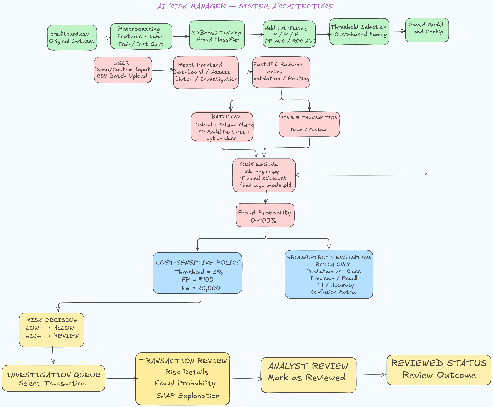

AI Risk Manager — Intelligent Transaction Fraud Detection

AI Risk Manager is an end-to-end fraud detection and risk analysis project built around a simple idea: a fraud prediction is more useful when it can also be understood and acted on.

The application takes transaction data, predicts the probability of fraud, converts that probability into a risk level using a decision threshold, and provides SHAP-based explanations for the prediction.

The project brings together machine learning, risk scoring, explainability, and a web dashboard in one workflow.

🚀 Project Overview

Fraud detection is more than answering "Is this transaction fraudulent?"

In a practical risk-management workflow, we also want to know:

How risky is the transaction?

How confident is the model?

What contributed to the prediction?

Why was the transaction flagged?

Which transactions should be investigated first?

AI Risk Manager is designed with these questions in mind.

A transaction can be analyzed individually or as part of a CSV file. The application processes the data, generates a fraud probability, applies the selected threshold, assigns a risk level, and presents the result through the dashboard.

✨ Key Features

🔍 Fraud Detection

The trained machine-learning model estimates the probability that a transaction is fraudulent.

📊 Risk Classification

The predicted probability is converted into a practical risk category so that suspicious transactions are easier to identify and prioritize.

🎯 Threshold-Based Decisions

Instead of blindly relying on the default classification threshold, the project uses a configurable probability threshold to decide when a transaction should be treated as high risk.

🧠 SHAP Explainability

SHAP is used to show which features had the biggest influence on an individual prediction. This makes the model output easier to investigate instead of treating it as a black box.

📁 CSV Batch Analysis

A CSV file containing multiple transactions can be uploaded and analyzed in one go.

🔎 Transaction Investigation

The dashboard provides transaction-level information so that suspicious records can be inspected in more detail.

🖥️ Interactive Dashboard

The web interface brings predictions, risk information, and model explanations together in one place.

⚡ End-to-End Workflow

The project connects data processing, model inference, risk assessment, explainability, and visualization into a single application.

🏗️ System Architecture

The application follows an end-to-end flow from transaction input to an explainable risk decision.

  

The main flow is:

Transaction Data → Web Interface → Data Processing → ML Model → Fraud Probability + SHAP Explanation → Risk Assessment → Investigation Dashboard

🧠 Machine Learning Approach

The model is trained on transaction-level financial data containing numerical features related to transaction behavior.

The overall machine-learning workflow is:

Raw Transaction Data
        ↓
Data Preprocessing
        ↓
Feature Preparation
        ↓
Model Training
        ↓
Model Evaluation
        ↓
Threshold Selection
        ↓
Model Deployment
        ↓
Risk Prediction
        ↓
Explainable Decision

Fraud detection is a highly imbalanced classification problem, so accuracy alone is not enough to judge the model.

The project considers:

Precision

Recall

F1-score

PR-AUC

ROC-AUC

Confusion Matrix

The decision threshold is also treated as an important part of the risk-management process because changing the threshold changes the balance between missed fraud and false alarms.

🔬 Explainability with SHAP

A fraud score by itself does not tell an investigator why the model made its decision.

For this reason, AI Risk Manager uses SHAP (SHapley Additive exPlanations) to break down individual predictions.

For an investigated transaction, the workflow looks like this:

Transaction
     ↓
Model Prediction
     ↓
Fraud Probability
     ↓
SHAP Explanation
     ↓
Features that increased or decreased the prediction

For example, the explanation can show that some features pushed the prediction toward a higher fraud probability while others pushed it in the opposite direction.

This gives the user additional context when reviewing a suspicious transaction.

SHAP explanations are intended to help understand the model's prediction. They should not be interpreted as proof that a transaction is actually fraudulent.

📂 Project Structure

The repository is organized to keep the application, model files, data, and experimentation work separated.

AI-Risk-Manager/
│
├── assets/
│   └── architecture.png
│
├── data/
│   ├── creditcard.csv
│   └── sample/
│       └── sample_transactions.csv
│
├── model/
│   └── <trained-model-files>
│
├── backend/
│   └── <backend-files>
│
├── frontend/
│   └── <frontend-files>
│
├── notebooks/
│   └── <training-and-analysis-notebooks>
│
├── requirements.txt
├── .gitignore
└── README.md

The exact structure may vary slightly depending on the final files included in the repository.

🛠️ Tech Stack

Machine Learning

Python

Scikit-learn

Pandas

NumPy

SHAP

Data Analysis & Visualization

Pandas

NumPy

Matplotlib

Other visualization libraries used by the project

Frontend

React

JavaScript

HTML

CSS

Backend / API

Python-based backend/API framework used by the application

Development & Version Control

Git

GitHub

📦 Dataset

The main training dataset used for this project is creditcard.csv.

The dataset was obtained from the Credit Card Fraud Detection dataset available on Kaggle:

Kaggle — Credit Card Fraud Detection Dataset

The dataset is used for model training and experimentation. A separate sample CSV is included for testing the application without depending on the original training data.

⚙️ Installation

1. Clone the repository

git clone https://github.com/<your-username>/<repository-name>.git
cd <repository-name>

2. Create a virtual environment

python -m venv venv

Activate it with:

Windows

venv\Scripts\activate

macOS / Linux

source venv/bin/activate

3. Install Python dependencies

pip install -r requirements.txt

4. Install frontend dependencies

Move into the frontend directory:

cd frontend
npm install

▶️ Running the Application

Start the backend using the backend entry point included in the repository.

For example:

python app.py

Then start the frontend:

cd frontend
npm run dev

The frontend development server will display the local URL where the application can be opened.

Use the actual backend entry file and commands included in the repository if they differ from the examples above.

📄 Using the Application

Single Transaction Analysis

For an individual transaction, provide the required transaction information through the application.

The system then produces:

Fraud Probability
       ↓
Risk Level
       ↓
Decision
       ↓
Explanation

This makes it possible to see both the model's prediction and the reasoning information associated with that prediction.

Batch CSV Analysis

The application also supports CSV-based analysis.

Upload a CSV containing transaction records and the application processes the rows and returns predictions for the uploaded transactions.

A sample CSV is included in the repository so that someone cloning the project can test the application without using the original training dataset.

📊 Model Evaluation

Because fraudulent transactions represent only a small portion of the overall dataset, the model is evaluated using metrics that give a better picture of performance than accuracy alone.

Precision

Precision tells us how many transactions predicted as fraud were actually fraudulent.

Recall

Recall tells us how many of the actual fraudulent transactions were successfully detected.

F1-score

F1-score combines precision and recall into a single metric and is useful when both types of errors matter.

ROC-AUC

ROC-AUC measures how well the model separates fraudulent and legitimate transactions across different classification thresholds.

PR-AUC

PR-AUC focuses on the relationship between precision and recall. It is especially useful for evaluating models on highly imbalanced datasets such as fraud detection.

🎯 Risk Threshold

The model produces a probability rather than simply returning a yes/no answer.

The threshold is then used to turn that probability into a practical decision:

P(fraud) < threshold
        ↓
Lower-risk decision

P(fraud) ≥ threshold
        ↓
Higher-risk decision

A lower threshold can catch more potentially fraudulent transactions, but it may also result in more false positives. A higher threshold can reduce false alarms, but it may allow some fraudulent transactions to pass through.

In a real financial system, the threshold would normally be selected using factors such as:

Cost of false positives

Cost of missed fraud

Investigation capacity

Fraud losses

Business requirements

For this project, the threshold is treated as a risk-management parameter rather than just a model setting.

🔐 Security & Data Handling

No real production credentials or secrets should be committed to the repository.

The repository should not contain:

API keys

Passwords

Access tokens

Private credentials

Environment secrets

Unnecessary personal information

Sensitive configuration should be handled using environment variables or another appropriate secure configuration method.

The training dataset and sample data should also be handled according to their licensing and usage requirements.

🧪 Testing the Application

A separate sample dataset is provided so the application can be tested without changing the training data.

A typical testing flow is:

Clone Repository
      ↓
Install Dependencies
      ↓
Start Backend
      ↓
Start Frontend
      ↓
Upload Sample CSV
      ↓
Run Prediction
      ↓
Review Risk Results
      ↓
Inspect SHAP Explanation

This gives a new user a straightforward way to understand the application after cloning the repository.

⚠️ Disclaimer

This project is intended for educational, research, demonstration, and portfolio purposes.

It is not a production-ready financial fraud prevention system.

A real-world deployment would require additional work around areas such as:

Secure data pipelines

Model monitoring

Data drift detection

Continuous model validation

Authentication and authorization

Privacy protection

Compliance and regulatory requirements

Production infrastructure

Human review processes

False-positive management

The predictions generated by this project should therefore be treated as model outputs for demonstration and analysis, not as final financial decisions.

🔮 Future Improvements

There are several directions in which the project could be extended:

Real-time transaction scoring

Model monitoring and drift detection

Automated retraining pipelines

Advanced anomaly detection

User and account behavioral profiling

Streaming transaction analysis

Continuous model performance monitoring

More detailed investigation workflows

Role-based access control

Production-grade deployment

👨‍💻 Author

Ranit Sarkhel

B.Tech — Computer Science & Engineering

This project was built as an end-to-end exploration of machine learning, explainable AI, and risk-management workflows for financial fraud detection.

⭐ Project Goal

The main goal of AI Risk Manager is not simply to build a model that predicts fraud.

The idea is to show what can be done after the model makes a prediction.

The complete workflow is:

Prediction
    +
Fraud Probability
    +
Risk Threshold
    +
Explanation
    ↓
Actionable Risk Decision

By combining these pieces, the project turns a machine-learning prediction into something that can be inspected, understood, and used as part of a risk-management workflow.
